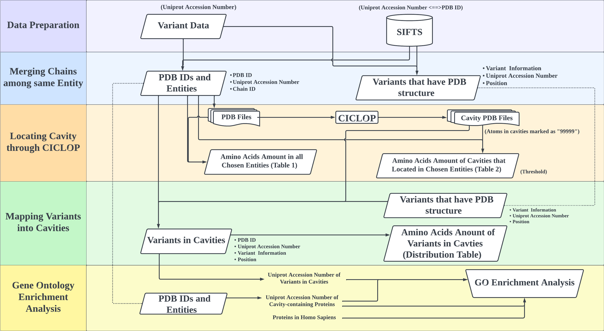

## A workflow to Discover the variant on Cavities Surface of Proteins
### Abstract
Cavity is one sort of protein structure features, and it looks like a void inside of protein and it could connect to outside through tunnel or it could be totally closed. This kind of special protein structures make it have significantly biological function, for example binding sites for enzyme or molecule transportation and so on. And, the variants in protein cavities might influent the biological function. The insight of protein cavities and regulation of variants in protein cavities might be still unclear enough. To discover the feature of protein cavities and the feature of variants in cavities, we use experimentally validated amino acid substitution mutation dataset from VariBench as sample and detect protein cavities in mutation-containing protein structures through CICLOP, then discover the feature of protein cavities found by CICLOP. We will also map the variant to protein structures to get variants that locate on the surface of protein cavities, and get insight of these amino acid substitution. This project is a workflow that include couple of programs.      
       

        
### Package and environment
```
conda   22.9.0
python  3.9
pandas  1.4
numpy   1.21
bs4     4.11.1   
beautifulsoup4  4.11.1 
```
### Usage
Firstly, clone this repository in local computer
```
mkdir cavity
cd cavity
git clone git@github.com:luhuim/Variant_in_cavity.git
```
Then running following command: (command should be run in root directory `cavity/` indefault.)
#### mapped uniprot ID to PDB structure
One Uniprot ID could be mapped to couple of PDB structures.
```
python scr/parse.py data/uniprot_segments_observed.tsv scr/All_species_train.csv collect_PDB/first_parse.tsv
```
#### only keep the proteins that have PDB structure in sample variant dataset.
```
python scr/variant.py data/All_species_train.csv result/collect_PDB/first_parse.tsv result/variant_info/variant.tsv
```
#### Organizing PDB information, making the information for same chains merge in one row.
```
python scr/merge_sub-chains.py result/collect_PDB/first_parse.tsv result/PDB_one_chain_one_line/merge_data_1.tsv 
```
#### removing identitical chains under same protein entity
```
python scr/2022-11-23-Filtering.py result/PDB_one_chain_one_line/merge_data_1.tsv result/PDB_and_entities/merge_data_11_23.tsv
```
#### download `CICLOP` in `result/CICLOP/`
```
wget --page-requisites --span-hosts --convert-links --no-directories --directory-prefix=output 'https://ciclop.raylab.iiitd.edu.in/standalone/'
```
#### Download PDB files and fasta files, getting cavities information through CICLOP
Getting a list of PDB IDs
```
cut -f 1 result/PDB_and_entities/merge_data_11_23.tsv|sort|uniq > result/CICLOP/dist/PDB_list.tsv 
```
The parameter content that should write in `result/CICLOP/dist/ciclop_parameters.txt`
```
PDB_File_Name: PDB.pdb                                                                                                                                        
FASTA_FILE_NAME: PDB.FASTA                                                                                                                                    
Alignment: 1                                                                                                                                                  
Cons_score: NO                                                                                                                                                
Rate_inf_method: EB                                                                                                                                           
Evo_model: JCamino                                                                                                                                            
E_value: 10                                                                                                                                                   
Blast_method: j                                                                                                                                               
nr_db: 
swissprot:                                                             
psiblast:                                                           
jackhmmer: 
```
In `result/CICLOP/dist`, running `Run_CICLOP.sh` to get cavities information.
Here is the content of `Run_CICLOP.sh`
```
#!/bin/bash                 
cat PDB_list.tsv |while read line; 
do wget https://files.rcsb.org/download/$line.pdb;                                          
   wget https://www.rcsb.org/fasta/entry/$line -O $line.fasta;                                                                              
   python Writing_Parameter.py $line ciclop_parameters.txt; #fill parameter file
   ./CICLOP; # the software "CLCLOP" must be run in dist/ folder
   done                                                                                                               
```
In `result/CICLOP/dist`
```
bash scr/Run_CICLOP.sh
```
The output file is in another folder called`result/CICLOP/dist/Upload_pdbs/`.
#### copy all PDB files that marked by CICLOP into another folder
Copy all pdb files `*-inner_surface_marked.pdb` into directory: `result/CICLOP/all_inner_surface/`.
The command below must run in `result/CICLOP/`.
```
find ./dist/Uploaded_pdbs/*/ -name "*-inner_surface_marked.pdb" -exec cp {} all_inner_surface/ \;
```
#### For every `-inner_surface_marked.pdb` files, only leaving the rows of atom that have cavity mark. And count the amino acid amount in cavity
The command below must run in `result/CICLOP/`.
```
nohup python Choose_cavity_atom_2022_12_16.py ../PDB_and_entities/merge_data_11_23.tsv all_inner_surface/ only_cavity/ ../Count_every_cavity/Amino_Acid_Count.tsv > choose_cavity.log 2>&1 &             
```

#### Seperate `merge_data_11_23.tsv` into ten files
Because later `Mapping` step takes to much CPU, so we plan to seperate `merge_data_11_23.tsv` into ten files, then do the mapping steps.   
Open folder `/home/inf-31-2021/Research_Project/test_2022_11_14/test_2022_11_23/`
```
cd /home/inf-31-2021/Research_Project/test_2022_11_14/test_2022_11_23/
bash Split.sh 
```
And there will generete 10 parts.

#### Amino acid distribution in cavities and setting "threshold"
Run this command in root directory 
```
nohup python scr/Choose_cavity_atom_2022_12_16.py result/PDB_and_entities/merge_data_11_23.tsv result/CICLOP/all_inner_surface/ result/CICLOP/only_cavity/ result/Amino_Acid_Distribution/Amino_Acid_Count.tsv > choose_cavity.log 2>&1 &                  
```
Adding threshold and run again:
```
nohup python scr/Count_Amino_Acids_2022_12_16.py result/PDB_and_entities/PDB_ID_list.tsv 3 result/CICLOP/only_cavity/ result/Amino_Acid_Distribution/Cavity_Amino_acid_3.tsv > Threshold_3.log 2>&1 &
nohup python scr/Count_Amino_Acids_2022_12_16.py result/PDB_and_entities/PDB_ID_list.tsv 2 result/CICLOP/only_cavity/ result/Amino_Acid_Distribution/Cavity_Amino_acid_2.tsv > Threshold_2.log 2>&1 &
nohup python scr/Count_Amino_Acids_2022_12_16.py result/PDB_and_entities/PDB_ID_list.tsv 1 result/CICLOP/only_cavity/ result/Amino_Acid_Distribution/Cavity_Amino_acid_1.tsv > Threshold_1.log 2>&1 &
```
#### Mapping variant with cavities
The command below is to mapping the variant amino acids on cavities found before.  
This program should run in root directory
```
cd ~
```
Run this command below:
```
for i in 00 01 02 03 04 05 06 07 08 09 10 ; 
do nohup python -u scr/Mapping_21_12_26_test.py result/variant_info/variant.tsv PDB_and_entities/merge_data_part_$i result/CICLOP/only_cavity/ result/mapping_variant/merge_data_part_${i}_output.tsv > result/mapping_variant/merge_data_part_$i.log 2>&1 &;  done  
```
And the result is ten files. To merge the ten output files together, here is following step:
```
cd result/mapping_variant/
bash Merge.sh
```
The result `variant_cavities.tsv` is the ouput files. This file include all amino acid variants that locate in cavities.

#### Making variant distribution table
Select Uniprot ID that have variant on cavity surface, and add these ID into a text file, called `Variant_Uniprot.tsv` 
This command should be run in home directory
```
cut -f 3 result/mapping_variant/variant_cavity.tsv |tail -n +2 |sort|uniq > result/mapping_variant/Variant_Uniprot.tsv
```
Compare the amount of Uniprot IDs between original file `variant.tsv` and `Variant_Uniprot.tsv`
```
#The amount of Uniprot ID in variant.tsv
cut -f 3 result/variant_info/variant.tsv |tail -n +2 |sort|uniq|wc -l 
#923
#The amount of Uniprot ID in Variant_Uniprot.tsv
cat result/mapping_variant/Variant_Uniprot.tsv |wc -l
#489
```
The cavity variant distribution table can be generated through the command below:
Amino acids on column label means original amino acid in cavities.
Amino acids on raw lable means variant amino acid in cavities.
```
python scr/count_variant.py result/mapping_variant/variant_cavity.tsv result/Variant_distribution/Variant_Summary.xlsx
```
#### Statistical analysis
This part was done by R, these program should be run in Windows system
Here is the list of R program used in this project:
```
scr/Barchart_of_Threshold.R  #to make a plot showing amino acid distribution of cavities, and adding the threshold.
scr/Statistics_Analysis.Rmd  #to do statistical test
scr/GO_Enrichment_Analysis_in_Variant.Rmd #to do GO enrichment analysis
```


